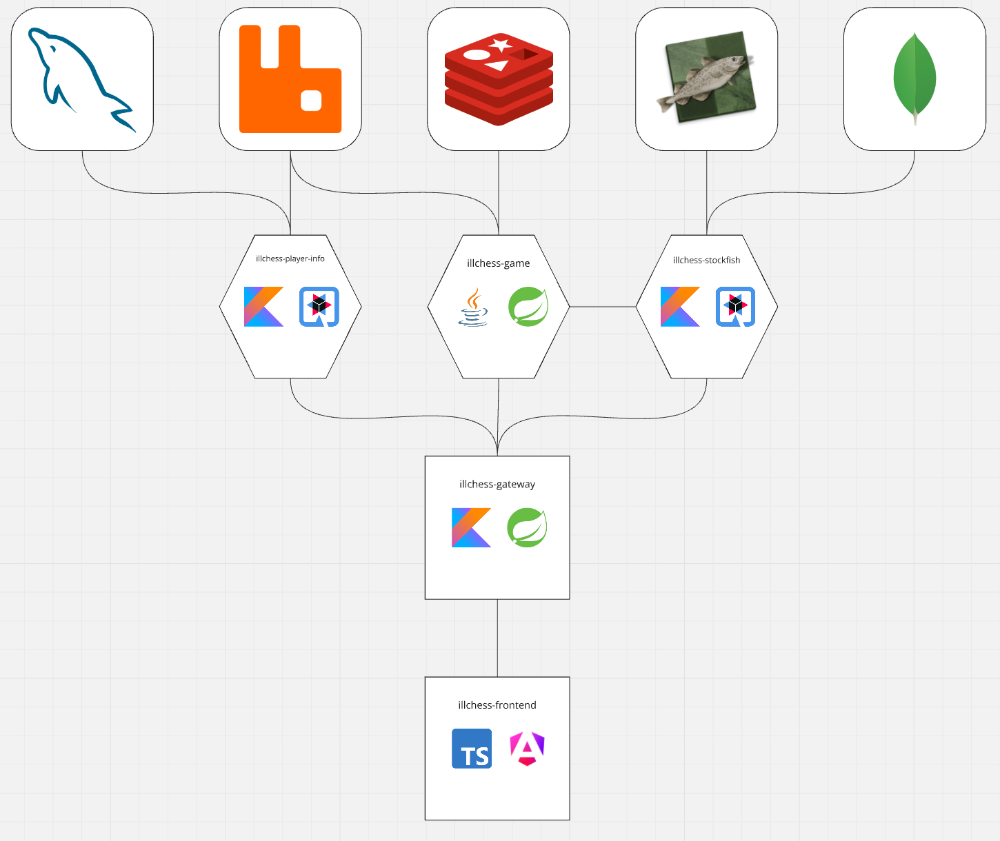

# Illchess

Online chess application 

## 1. App description

App is written in microservices architecture.
Main services responsible for core functionalities
(**illchess-game**, **illchess-stockfish**, **illchess-player-info**) 
are written in hexagonal architecture with usage of CQRS (no event sourcing) and DDD.

### 1.1 App services description
***
#### illchess-game
Implementation: Java + Spring

Service responsible for handling games in application.
Features full chess game logic. 
Currently played games are stored in **Redis** database.
After detecting game finish (for example by checkmate or resignation) sends info with full game info onto **RabbitMQ** queue.
Only after receiving event with info of successful game save deletes it from active games.
For presenting real time data about active games (for example current position) websocket connections are used. 
 ***
#### illchess-stockfish
Implementation: Kotlin + Quarkus

Service responsible for communication with stockfish chess engine.
Provides evaluation and best moves in position based on game provided by **illchess-game** service.
 Service also provides bot management and logic. Configuration of bot functionality includes:
 * **bots.max-count** - maximum count of simultaneously playing bots 
 * **bots.expiration-check-cron** - cron for checking if bot is expired
 * **bots.expiration-minutes** - amount of minutes which bot is playing games

Service has two modes of operation:
* **engine** - service is communicating with engine present on host machine 
* **API** - service is communicating API available here: https://stockfish.online/
***
#### illchess-player-info
Implementation: Kotlin + Quarkus

Service responsible for handling data concerning finished games and info about players.
After receiving info about finished game from **RabbitMQ** queue 
calculates and overrides current ELO points of players ([Elo rating system](https://en.wikipedia.org/wiki/Elo_rating_system))
and stores data of finished game to **MySQL** database.
***
#### illchess-gateway
Implementation: Kotlin + Spring
 
Gateway for backend services
***
#### illchess-frontend
Implementation: Angular

Frontend for application. 
***

### 1.2 Additional info

In order to ensure that events shared between application services are received, inbox and outbox patterns are used.
The implementation of patterns was accomplished by using following library: [inbox-outbox](https://github.com/shane3102/inbox-outbox)

